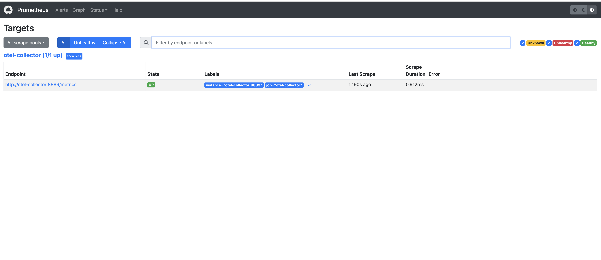
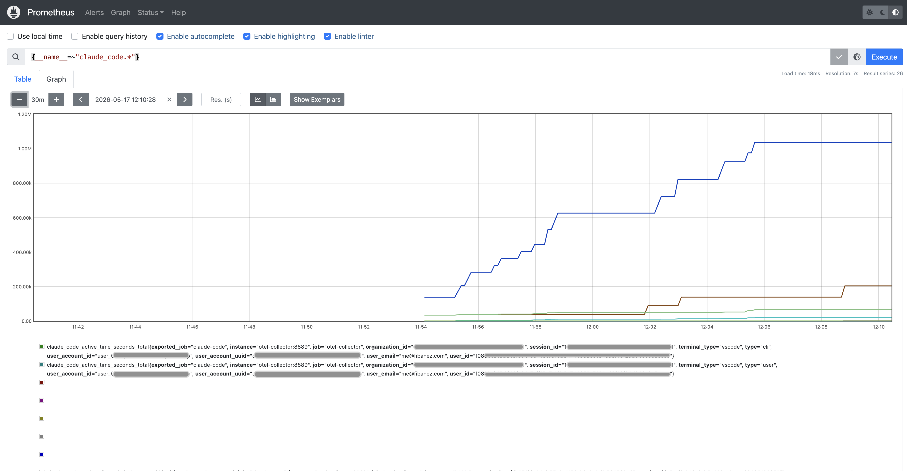
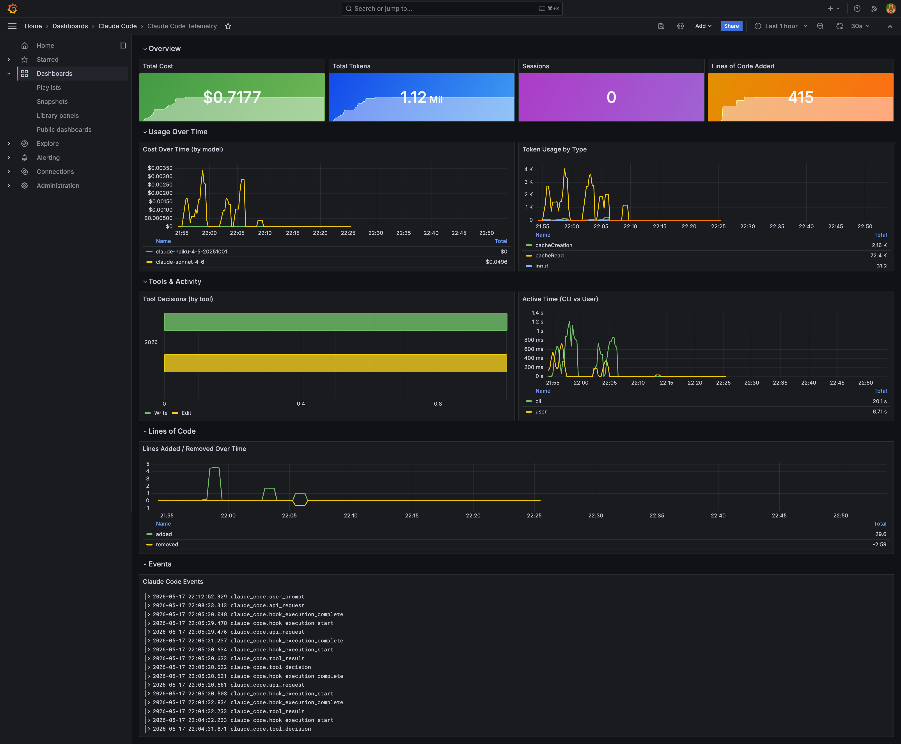

# Dev Container — Observability Stack

The devcontainer bundles a full observability pipeline alongside the Next.js app. Claude Code telemetry (sessions, tokens, cost, tool use, API events) is automatically exported to the collector when `claude` runs — metrics land in Prometheus, events in Loki, and a pre-built Grafana dashboard surfaces everything.

## Services

| Service | Local port | Purpose |
|---|---|---|
| Next.js / app | 3000 | Dashboard dev server |
| OpenTelemetry Collector | 4317 (gRPC) / 4318 (HTTP) | OTLP ingest from the app and Claude Code |
| Prometheus | 9090 | Metrics storage (scrapes collector:8889) |
| Loki | 3100 | Log/event storage |
| Grafana | 3001 | Dashboards — metrics + logs |
| DynamoDB Local | 8000 | Local DynamoDB (start on demand) |

## Start the stack

```bash
docker compose up -d
```

## Verify telemetry is flowing

### 1. Confirm Prometheus is scraping the OTel collector

Open `http://localhost:9090/targets` — the `otel-collector` job should show **UP**.



### 2. Generate telemetry

Run any `claude` command. The Claude Code CLI reads the env vars in `.claude/settings.local.json` or `.claude/settings.json` and exports OTLP over gRPC to `localhost:4317`.

```yaml
 "env": {
    "CLAUDE_CODE_ENABLE_TELEMETRY": "1",
    "OTEL_SERVICE_NAME": "bedrock-cost-dashboard",
    "OTEL_METRICS_EXPORTER": "otlp",
    "OTEL_LOGS_EXPORTER": "otlp",
    "OTEL_EXPORTER_OTLP_PROTOCOL": "grpc",
    "OTEL_EXPORTER_OTLP_ENDPOINT": "http://localhost:4317",
    "OTEL_EXPORTER_OTLP_METRICS_TEMPORALITY_PREFERENCE": "cumulative",
    "OTEL_METRIC_EXPORT_INTERVAL": "10000"
  },
```

### 3. Confirm metrics arrived

In the Prometheus query UI at `http://localhost:9090/graph`, run:

```
{__name__=~"claude_code.*"}
```

You should see metrics such as `claude_code_cost_usage_total`, `claude_code_tokens_usage_total`, and `claude_code_tool_use_count_total`.



### 4. Open Grafana

Go to `http://localhost:3001` and log in:

- **Username:** `admin`
- **Password:** contents of `.devcontainer/grafana_admin_password.txt`

The **Claude Code Telemetry** dashboard is pre-loaded under the **Claude Code** folder. It includes:

- Total cost, tokens, API requests, and tool uses (stat panels)
- Cost over time and token breakdown by type (input / output / cacheRead / cacheCreation)
- Top tools used (horizontal bar chart)
- API request latency — p50 and p95
- Live Claude Code event log (from Loki)

The dashboard auto-refreshes every 30 seconds and defaults to a 1-hour window.



## Claude Code telemetry env vars

Set in `.claude/settings.local.json` (applies when running `claude` on the host):

| Variable | Value | Purpose |
|---|---|---|
| `CLAUDE_CODE_ENABLE_TELEMETRY` | `1` | Enables OTLP export |
| `OTEL_SERVICE_NAME` | `claude-code` | Labels all metrics and logs |
| `OTEL_METRICS_EXPORTER` | `otlp` | Exports metrics via OTLP |
| `OTEL_LOGS_EXPORTER` | `otlp` | Exports logs/events via OTLP |
| `OTEL_EXPORTER_OTLP_PROTOCOL` | `grpc` | Uses gRPC (port 4317) |
| `OTEL_EXPORTER_OTLP_ENDPOINT` | `http://localhost:4317` | Collector endpoint (host → container) |
| `OTEL_EXPORTER_OTLP_METRICS_TEMPORALITY_PREFERENCE` | `cumulative` | Required by Prometheus |
| `OTEL_METRIC_EXPORT_INTERVAL` | `10000` | Export every 10 s |

The same vars are set in `docker-compose.yml` for the `app` service (with `OTEL_EXPORTER_OTLP_ENDPOINT=http://otel-collector:4317` for in-container access).

## Troubleshooting

**otel-collector fails to start**
Check `.devcontainer/otel/otel-collector-config.yaml`. Exporter type must be `otlphttp` (no underscore) — not `otlp_http`.

**Prometheus target is DOWN**
The collector exposes metrics on port 8889. Confirm the `prometheus` exporter is in the collector config's `service.pipelines.metrics.exporters` list.

**No `claude_code.*` metrics in Prometheus**
Ensure `CLAUDE_CODE_ENABLE_TELEMETRY=1` is set and that `claude` was run after the collector started. Metrics only appear after the first export interval (10 s).

**Dashboard shows "No data"**
The dashboard filters by `service_name="claude-code"`. Confirm `OTEL_SERVICE_NAME=claude-code` is set in the env before running `claude`.
